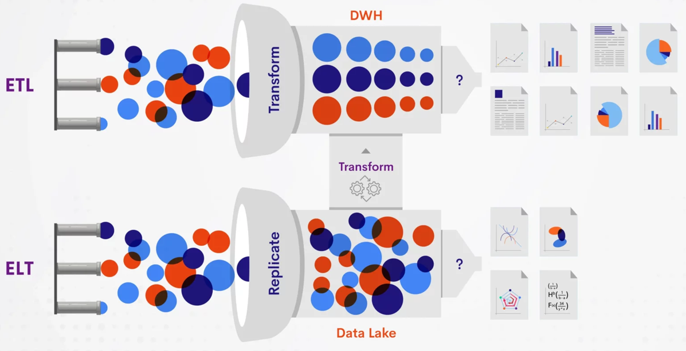

# DWH и Datalake

## Что такое DWH (Data Warehouse)

- **DWH (Data Warehouse, хранилище данных)** — централизованное, структурированное аналитическое хранилище, куда собираются данные из разных источников.
- Классическое определение хранилища данных подчёркивает четыре свойства:
  - **Subject‑oriented** — организовано вокруг предметных областей (продажи, финансы, логистика), а не вокруг конкретных приложений.
  - **Integrated** — данные из разных источников приводятся к согласованным справочникам, кодировкам и структурам.
  - **Non‑volatile** — данные после загрузки, как правило, не изменяются разрушительно, а только дополняются (важна возможность видеть историю).
  - **Time‑variant** — хранилище содержит информацию о состоянии данных во времени, позволяя анализировать прошлое, а не только текущий срез.
- Типичные сценарии использования DWH:
  - Корпоративная отчётность и регламентированные отчёты.
  - BI‑дашборды для менеджмента и продуктовых команд.
  - Витрины данных для аналитиков и смежных систем.

## Что такое Datalake

- **Datalake** — масштабируемое хранилище данных, в котором можно держать большие объёмы разнородной информации в различных форматах (структурированных, полу- и неструктурированных).
- Важно, что Datalake — это **логическая концепция**, а не конкретный продукт или платформа:
  - Он предполагает возможность дешёвого хранения больших объёмов данных.
  - Данные могут попадать в озеро в почти сыром виде, без жёсткого навязывания схемы на этапе записи.
- Типичные сценарии:
  - Хранение сырых событий и логов, которые пока не ясно, как именно будут использоваться.
  - Подготовка данных для задач Data Science и машинного обучения.
  - Сохранение промежуточных слоёв обработки (от сырого к очищенному и далее к витринному).

## Как связаны DWH и Datalake, могут ли существовать отдельно

Наиболее сжато и полно взаимосвязь этих субъектов отражена на картинке ниже:

- **Связь**:
  - Datalake часто используется как «земля» сырых и полуобработанных данных.
  - DWH строится поверх части этих данных в виде более строгих, управляемых моделей и витрин.
  - DWH обычно фокусируется на структурированной информации и стабильных отчётных контурах.
- **Могут ли существовать отдельно**:
  - Да, возможны разные варианты:
    - Только DWH: достаточно, если объёмы и разнообразие данных умеренные, а основная цель — отчётность и классическая BI‑аналитика.
    - Только Datalake: подходит, когда основная ценность — гибкое хранение разнородных данных и поддержка исследовательских сценариев, в том числе ML/DS.
    - Совместное использование: наиболее распространённая современная картина, где Datalake служит фундаментом, а DWH — слоем структурированных витрин.

## Зачем придумывали Datalake, если уже был DWH

- Классические DWH хорошо работают для структурированных данных и предсказуемых отчётных задач, но:
  - Могут быть дорогими при попытке хранить в них всё подряд.
  - Требуют заранее спроектированной схемы, что затрудняет работу с новыми, слабо понятными источниками.
  - Не всегда удобны для неструктурированных данных (тексты, события произвольного формата, мультимедиа).
- Datalake решает эти проблемы:
  - Позволяет хранить данные «как есть» (schema‑on‑read: схема определяется в момент чтения под конкретную задачу).
  - Поддерживает широкий спектр форматов и типов данных.
  - Может служить долгосрочным архивом истории, поверх которого строятся разные потребители — от DWH до ML‑платформ.

