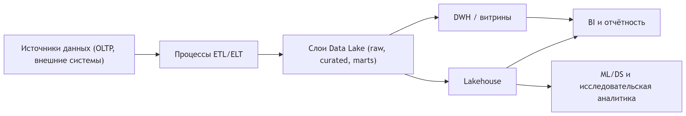

# Как связаны ETL/ELT, DWH, Datalake и Lakehouse

## Типичный поток данных

На концептуальном уровне распространённый поток данных можно описать так:

- Источники данных (операционные системы, внешние сервисы) генерируют транзакции и события — это мир OLTP.
- Процессы ETL или ELT извлекают эти данные и переносят их в аналитическое окружение.
- В аналитическом окружении:
  - Могут существовать слои в духе Datalake (сырые, очищенные, витринные данные).
  - Поверх части этих данных строится DWH или Lakehouse, предоставляющие удобный интерфейс для аналитики.

Диаграмма потока (условно, без привязки к технологиям):

## Роли и ответственность элементов

- **ETL/ELT**:
  - Отвечают за надёжную доставку данных из источников в аналитическое окружение.
  - Реализуют очистку, приведение к общим справочникам, обогащение, агрегации.
- **Datalake**:
  - Является фундаментом для хранения сырых и полуобработанных данных.
  - Обеспечивает возможность вернуться к исходным данным и переосмыслить модель при появлении новых задач.
- **DWH**:
  - Предоставляет устойчивые, управляемые, хорошо документированные витрины данных для отчётности и BI.
  - Хорошо подходит для сценариев с жёсткими требованиями к качеству и воспроизводимости отчётов.
- **Lakehouse**:
  - Пытается объединить в одном контуре потребности BI и ML/DS.
  - Снижает количество дублей данных и границ между «озером» и «хранилищем».

## Эволюционный путь

На практике архитектура редко появляется сразу в законченном виде. Чаще всего компания проходит путь:

1. **«Одна база для всего»**:
   - Одна операционная база данных, в которой пытаются делать как транзакции, так и аналитику.
   - Со временем аналитическая нагрузка начинает мешать операционной работе.
2. **Выделение отдельного DWH**:
   - Появляется хранилище данных, в которое реплицируются и агрегируются данные из операционных систем.
   - Улучшается качество отчётности и разгружается OLTP‑контур.
3. **Добавление Datalake**:
   - Возникает потребность хранить всё больше разнородных данных и поддерживать исследовательские сценарии.
   - Появляется озеро данных как место для сырых и экспериментальных наборов.
4. **Движение в сторону Lakehouse**:
   - Стремление уменьшить количество копий, упростить ландшафт и дать единое хранилище для разных типов потребителей.
   - Появляются решения, которые предоставляют «табличный» и транзакционный интерфейс поверх данных в духе Datalake.
