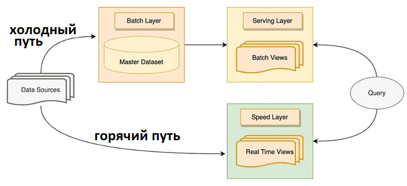

# Lambda Architecture

Это гибридный подход, который был предложен первым [Натаном Марцем](https://dstglobal.ru/club/950-chto-takoe-lambda-arhitektura) и стал "классикой" Big Data.

## Фундаментальная концепция и основные понятия

Главная идея Lambda — разделение ответственности. Система делится на три независимых слоя, каждый со своей задачей:

* **Пакетный слой (Batch Layer):**
  * **Назначение:** Хранение неизменяемого master-набора всех данных и пересчет сложных агрегатов (batch views) на всех данных целиком.
  * **Свойства:** Точный, но медленный (задержка от часов до дней). Обеспечивает «источник правды».
* **Слой реального времени (Speed Layer):**
  * **Назначение:** Компенсация задержки пакетного слоя. Обрабатывает только новые данные «на лету» и выдает быстрые, но неточные (промежуточные) результаты (realtime views).
  * **Свойства:** Быстрый, но его данные считаются временными.
* **Сервисный слой (Serving Layer):**
  * **Назначение:** Объединение результатов. При поступлении запроса этот слой смотрит в подготовленные пакетные данные (за вчера) и в данные реального времени (за сегодня), объединяет их и выдает финальный ответ пользователю .

## Компоненты реализации

* **Batch Layer:** Hadoop (HDFS для хранения, MapReduce для обработки), Apache Spark (в batch-режиме).
* **Speed Layer:** Apache Kafka (для приема потока), Apache Storm, Apache Flink, Spark Streaming.
* **Serving Layer:** NoSQL базы данных (Apache HBase, Cassandra), реляционные БД (PostgreSQL), предрассчитанные ключ-значение хранилища.

## Когда и для чего применяется

Lambda применяется там, где **критически важна математическая точность** и при этом есть потребность в данных реального времени. Классические примеры:

* **Ритейл:** Отчеты по продажам за прошлые периоды (batch) + мгновенные остатки на складе (speed).
* **Банкинг:** Анализ многолетней кредитной истории (batch) + проверка текущей транзакции на фрод (speed).

## Реализация на практике (Flow)

1. Входящий поток данных дублируется и уходит одновременно в два слоя.
2. В Batch Layer данные накапливаются в HDFS, и раз в сутки (или час) Spark пересчитывает тотальные витрины (например, сумма продаж по всем товарам за всё время).
3. В Speed Layer тот же поток сразу попадает в Kafka и обрабатывается Flink, который считает сумму продаж за последние 5 минут.
4. Пользователь заходит в дашборд. Serving Layer получает запрос, берет точные данные из Batch (за вчера) и прибавляет к ним текущие данные из Speed (за сегодня), отдавая результат.
