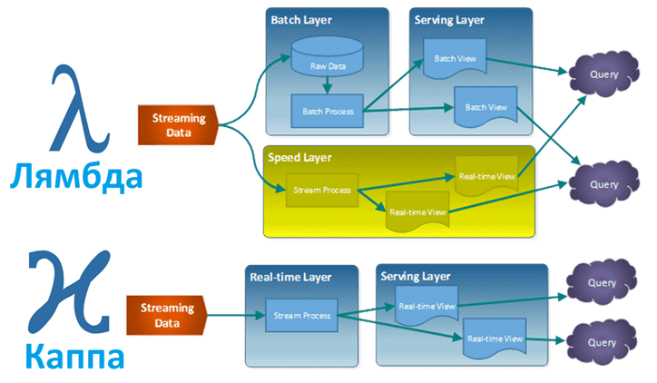

# Kappa Architecture

Это эволюционная архитектура, предложенная [Джеем Крепсом](https://origin.geeksforgeeks.org/kappa-architecture-system-design/) из LinkedIn как ответ на сложность поддержки Lambda.

## Фундаментальная концепция и основные понятия

Kappa утверждает, что не нужно разделять обработку. Достаточно одного **слоя потоковой обработки (stream processing layer)** и мощной системы хранения потоков:

- **Унификация:** Весь входящий поток данных захватывается и сохраняется в отказоустойчивом, распределенном логе (commit log), таком как Apache Kafka.
- **Единый движок:** Один и тот же код потокового движка обрабатывает данные.
- **Пересчет через воспроизведение (Reprocessing):** Если нужно обновить логику (или исправить ошибку), вы останавливаете текущее приложение, исправляете код и запускаете его заново, но уже не с нуля, а считывая данные из того же долгосрочного лога (Kafka) с нужной точки в прошлом .

## Компоненты реализации

- **Хранилище событий (Log):** Apache Kafka (стандарт де-факто), Pravega, Pulsar. Оно должно хранить данные долго (дни или недели), чтобы можно было перемотать время назад .
- **Потоковый движок (Stream Processor):** Apache Flink (лучший для сложной логики и управления состоянием), Kafka Streams (легковесный), Spark Streaming .
- **Serving Layer:** Те же, что и в Lambda (Cassandra, Elasticsearch, ClickHouse), но наполняемые напрямую из потока.

## Когда и для чего применяется

Kappa идеальна для сценариев, где **аналитика в реальном времени — это базовая функциональность**, а не опция, и команда хочет избежать дублирования кода. Примеры:

- **IoT (Интернет вещей):** Непрерывный поток телеметрии с тысяч датчиков.
- **Мониторинг и оповещение (Fraud detection):** Системы, которые должны реагировать на аномалию сразу же.
- **Рекомендательные системы в моменте:** Лента новостей, где релевантность поста падает через минуту.
- **Крупные интернет-компании:** Netflix, Uber, Shopify используют Kappa-подход для обработки событий от пользователей в реальном времени .

## Реализация на практике (Flow)

1. Все события (клики, транзакции) пишутся в распределенный лог Kafka.
2. Запущено постоянно работающее приложение на Flink, которое читает лог, считает окна (например, скользящее среднее) и пишет результаты в ClickHouse.
3. **Если баг:** Инженеры находят ошибку в логике расчета среднего.
4. **Исправление:** Они останавливают старый Flink-джоб, исправляют код, перезапускают новый джоб, указав ему читать топик Kafka **с того момента в прошлом, когда пошли неверные данные**.
5. Результаты перезаписываются, и система приходит в консистентное состояние без необходимости писать отдельный batch-джоб.
