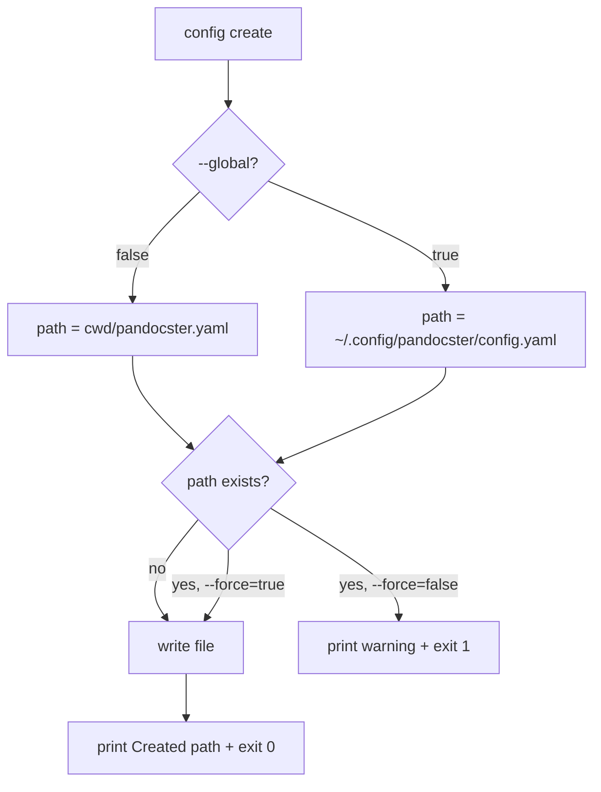

# Flowchart

```mermaid
flowchart TD
    A[config create] --> B{--global?}
    B -->|false| C["path = cwd/pandocster.yaml"]
    B -->|true| D["path = ~/.config/pandocster/config.yaml"]
    C --> E{path exists?}
    D --> E
    E -->|no| G[write file]
    E -->|yes, --force=false| F[print warning + exit 1]
    E -->|yes, --force=true| G
    G --> H[print Created path + exit 0]
```
